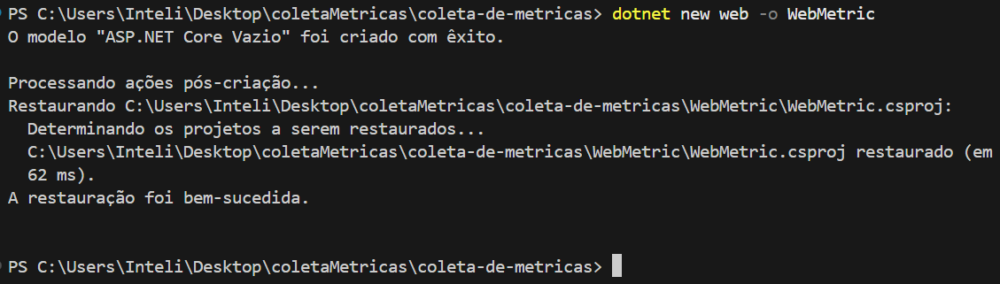
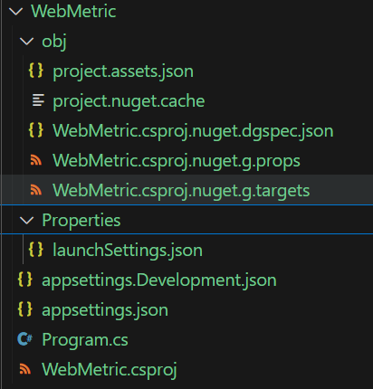
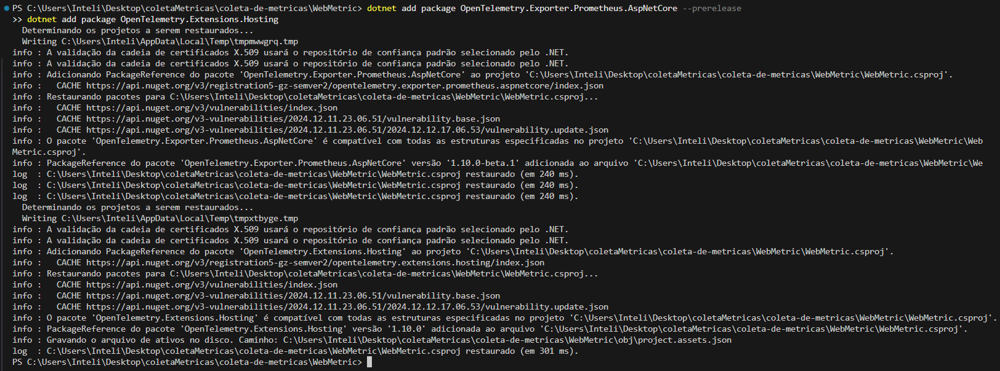
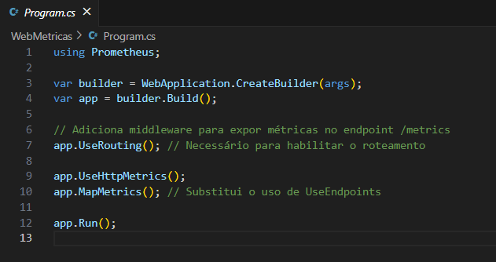
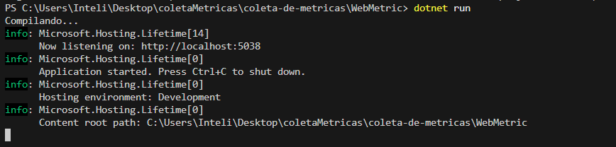
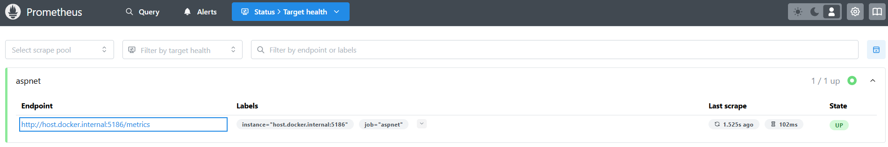
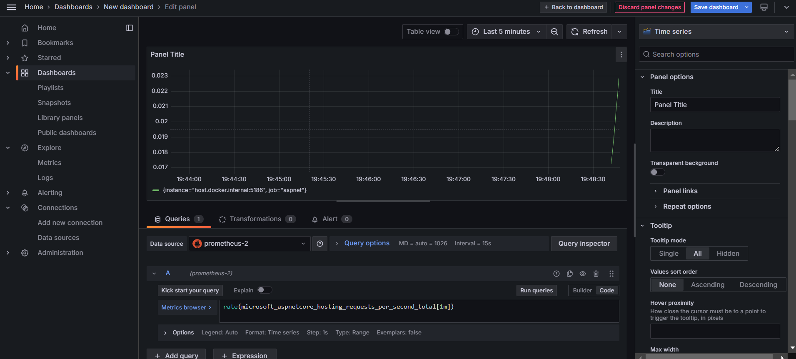
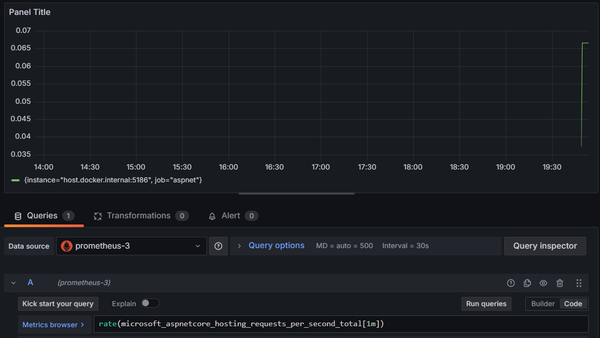

# Coleta de Métricas com Prometheus e Grafana

Este repositório contém a implementação para coletar e visualizar métricas de uma aplicação ASP.NET Core utilizando **Prometheus** e **Grafana**. Abaixo, segue o passo a passo para configurar o ambiente e realizar a coleta de métricas.

## Configuração do Ambiente

### 1. Criar um Repositório no GitHub
Crie um novo repositório no GitHub para armazenar o código-fonte da aplicação.

### 2. Configuração do Projeto em .NET

#### Criar o Projeto Web

Abra o terminal e execute o seguinte comando para criar um novo projeto em **ASP.NET Core**:

```bash
dotnet new web -o WebMetric
```





Isso criará uma estrutura básica de projeto na pasta `WebMetric`.

#### Adicionar Pacotes Necessários

Para coletar as métricas, adicione os pacotes **OpenTelemetry** e **Prometheus** com os seguintes comandos:

```bash
dotnet add package OpenTelemetry.Exporter.Prometheus.AspNetCore --prerelease
dotnet add package OpenTelemetry.Extensions.Hosting
```



#### Configurar o `Program.cs`

Substitua o conteúdo do arquivo `Program.cs` com o código abaixo:



```csharp
using Prometheus;

var builder = WebApplication.CreateBuilder(args);
var app = builder.Build();

// Adiciona middleware para expor métricas no endpoint /metrics
app.UseRouting(); // Necessário para habilitar o roteamento

app.UseHttpMetrics();
app.MapMetrics(); // Substitui o uso de UseEndpoints

app.Run();
```

### 3. Rodando o Aplicativo

Execute o aplicativo com o comando:

```bash
dotnet run
```


## Configuração do Prometheus

### 1. Baixar e Instalar o Prometheus

No terminal, baixe o Prometheus usando o comando:

```bash
wget https://github.com/prometheus/prometheus/releases/download/v2.47.0/prometheus-2.47.0.linux-amd64.tar.gz
```

Para extrair os arquivos:

```bash
tar -xvf prometheus-2.47.0.linux-amd64.tar.gz
cd prometheus-2.47.0.linux-amd64
```

### 2. Configurar o Arquivo `prometheus.yml`

Abra o arquivo de configuração do Prometheus com o comando:

```bash
nano prometheus.yml
```

Substitua o conteúdo pelo seguinte:

```yaml
global:
  scrape_interval: 15s
  evaluation_interval: 15s

scrape_configs:
  - job_name: 'prometheus'
    static_configs:
      - targets: ['localhost:9090']

  - job_name: 'MyASPNETApp'
    scrape_interval: 5s
    static_configs:
      - targets: ['localhost:5000'] # Substitua pela porta onde seu app está rodando
```

### 3. Rodar o Prometheus

Execute o Prometheus com o comando:

```bash
./prometheus --config.file=prometheus.yml
```


Abra o navegador e acesse `http://localhost:9090`. Vá até **Status > Targets** e você verá o status da coleta de métricas.

---

## Configuração do Grafana

### 1. Baixar e Iniciar o Grafana

Execute o comando para iniciar o Grafana utilizando Docker:

```bash
docker run -d -p 3000:3000 --name grafana grafana/grafana-oss:latest
```

Caso o container não esteja em execução, reinicie-o com:

```bash
docker start grafana
```

### 2. Configurar o Prometheus como Fonte de Dados

1. Abra o Grafana acessando `http://localhost:3000`.
2. Vá até **Configurações > Data Sources**.
3. Selecione **Prometheus** como a fonte de dados.
4. Configure o URL do Prometheus como `http://localhost:9090`.
5. Clique em **Save & Test** para verificar a conexão.

---

## Visualizando as Métricas no Grafana



### 1. Criar um Dashboard



Agora que o Prometheus está configurado como fonte de dados, você pode criar um dashboard no Grafana para visualizar as métricas.

1. No Grafana, vá até **Dashboards > New Dashboard**.
2. Adicione um painel e configure a consulta para visualizar as métricas, como o número de requisições HTTP:

```promql
rate(microsoft_aspnetcore_hosting_requests_per_second_total[1m])
```

### 2. Salvar o Dashboard

Depois de configurar os painéis com as métricas desejadas, salve o dashboard para visualização contínua.

---

## Conclusão

Com isso, você configurou com sucesso a coleta de métricas utilizando Prometheus e Grafana para uma aplicação ASP.NET Core. Agora, as métricas estão sendo coletadas e visualizadas em tempo real.
